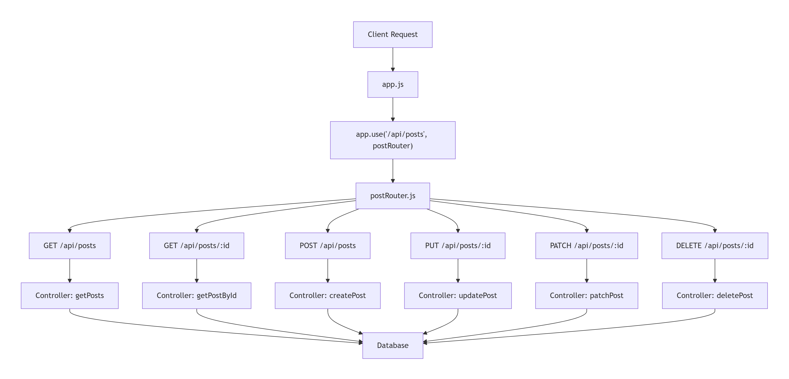

<<<<<<< HEAD
# Buổi 3: MVC, Controller

## Mục tiêu

=======
# Buổi 3: MVC, Controller 

## Mục tiêu
>>>>>>> 3041184eb43c278195e07d673609e6874d7b5944
- Hiểu mô hình MVC
- Xây dựng thành phần Controller trong MVC
- Tìm hiểu phản hồi trạng thái (http) trong Controller

## Mô hình MVC
<<<<<<< HEAD

=======
>>>>>>> 3041184eb43c278195e07d673609e6874d7b5944
- Mô hình MVC (Model - View - Controller) trong Express.js là một cách tổ chức mã nguồn giúp tách biệt rõ ràng giữa:

- Model: quản lý dữ liệu và tương tác với cơ sở dữ liệu.

<<<<<<< HEAD
- View (Nếu có): hiển thị giao diện thông qua tempalte enigme(Pug, EJS, Handlebars,... ), tuy nhiên trong API không dùng.
=======
- View (Nếu có): hiển thị giao diện thông qua tempalte enigme(Pug, EJS, Handlebars,... ),  tuy nhiên trong API không dùng.
>>>>>>> 3041184eb43c278195e07d673609e6874d7b5944

- Controller: xử lý logic, điều hướng dữ liệu giữa model và view.

- Route: (không chính thức trong MVC) định tuyến các request đến controller phù hợp.

---

## Controller:
<<<<<<< HEAD

- Trong Node.js (đặc biệt là khi sử dụng với framework như Express.js), controller là một phần của kiến trúc MVC (Model - View - Controller).
=======
- Trong Node.js (đặc biệt là khi sử dụng với framework như Express.js), controller là một phần của kiến trúc MVC (Model - View - Controller). 
>>>>>>> 3041184eb43c278195e07d673609e6874d7b5944

- Controller chịu trách nhiệm xử lý logic của yêu cầu (request) và gửi lại phản hồi (response) cho client.

- Những chức năng chính của controller:
<<<<<<< HEAD

  - Nhận và xử lý request từ client (qua route).
  - Gọi các hàm tương tác với database (qua model).
  - Xử lý dữ liệu, logic nghiệp vụ.
  - Gửi response (JSON, HTML, trạng thái, v.v.).

    
=======
  + Nhận và xử lý request từ client (qua route).
  + Gọi các hàm tương tác với database (qua model).
  + Xử lý dữ liệu, logic nghiệp vụ.
  + Gửi response (JSON, HTML, trạng thái, v.v.).
>>>>>>> 3041184eb43c278195e07d673609e6874d7b5944

### Trạng thái (HTTP Status Codes)

- Là các mã số 3 chữ số mà server gửi về client để thông báo kết quả xử lý một yêu cầu HTTP.
- HTTP status codes được chia làm 5 nhóm, dựa theo chữ số đầu tiên:
<<<<<<< HEAD

=======
>>>>>>> 3041184eb43c278195e07d673609e6874d7b5944
```
| Nhóm    | Ý nghĩa                                 | Dải mã  |
| ------- | --------------------------------------- | ------- |
| **1xx** | Thông tin – Request đang tiếp tục xử lý | 100–199 |
| **2xx** | Thành công – Request được xử lý OK      | 200–299 |
| **3xx** | Chuyển hướng – Cần hành động thêm       | 300–399 |
| **4xx** | Lỗi từ phía client                      | 400–499 |
| **5xx** | Lỗi từ phía server                      | 500–599 |
```

- Một số `HTTP Status Codes` thường gặp:
<<<<<<< HEAD

=======
>>>>>>> 3041184eb43c278195e07d673609e6874d7b5944
```
| Mã  | Ý nghĩa               | Mô tả ngắn                                    |
| --- | --------------------- | --------------------------------------------- |
| 200 | OK                    | Yêu cầu thành công                            |
| 201 | Created               | Đã tạo thành công tài nguyên mới              |
| 204 | No Content            | Thành công nhưng không trả về dữ liệu         |
| 400 | Bad Request           | Yêu cầu không hợp lệ                          |
| 401 | Unauthorized          | Chưa xác thực                                 |
| 403 | Forbidden             | Bị cấm truy cập                               |
| 404 | Not Found             | Không tìm thấy tài nguyên                     |
| 409 | Conflict              | Xung đột dữ liệu                              |
| 422 | Unprocessable Entity  | Dữ liệu hợp lệ về mặt cú pháp nhưng sai logic |
| 500 | Internal Server Error | Lỗi hệ thống                                  |

```

<<<<<<< HEAD
---
=======
---
>>>>>>> 3041184eb43c278195e07d673609e6874d7b5944
